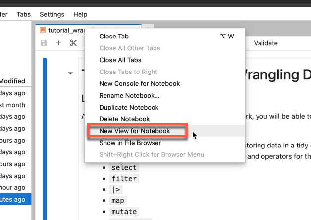
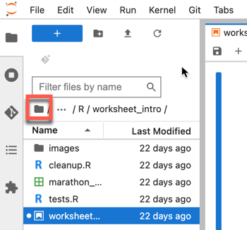
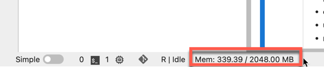
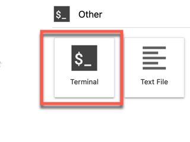

# JupyterLab Guide

This guide contains tips and FAQs which help to avoid common issues that arise when using JupyterLab.  

# Table of Contents
### Tips
1. [Open multiple notebook tabs](#open-multiple-notebook-tabs)
2. [Check solutions or feedback](#check-solutions-or-feedback)
3. [Check memory usage](#check-memory-usage)
4. [Get a fresh copy of a notebook](#get-a-fresh-copy-of-a-notebook)
5. [View hidden files](#view-hidden-files)
6. [Get a copy of everything](#get-a-copy-of-everything)

### FAQs
1. [Why did I get a zero/low-mark when I submitted everything on time?](#why-did-i-get-a-zerolow-mark-when-i-submitted-everything-on-time)
2. [Why are none of my cells running?](#why-are-none-of-my-cells-running)
3. [Why does my kernel keep dying?](#why-does-my-kernel-keep-dying)
4. [Why did I get a zero on a question when all the tests passed?](#why-did-i-get-a-zero-on-a-question-when-all-the-tests-passed)
5. [Why did I get a low mark on a question when all the tests passed?](#why-did-i-get-a-low-mark-on-a-question-when-all-the-tests-passed)
6. [I made a typo in my code, can I still get marks for the question?](#i-made-a-typo-in-my-code-can-i-still-get-marks-for-the-question)

## Tips

## Open multiple notebook tabs

When working on a notebook, you might want to have multiple tabs of the same notebook open to easily reference previous questions.

**DO NOT** open another browser tab, create another instance of JupyterLab, and open the same notebook. Doing so may overwrite the notebook you are working on with an empty or half-completed version.

Instead, use JupyterLab's built in tab functionality to create another view for the notebook.

To do so in JupyterLab, right click the tab that contains the notebook in question.

On the dropdown menu, click **New View for Notebook**:    



This will create a split screen, showing a copy of the notebook on half of the screen.

## Check solutions or feedback

Solutions and feedback are uploaded to your home directory. This is a different directory to where assignments are stored.

To get to your home directory, open JupyterLab and then click the small grey folder icon on top of the menu to the left that shows files and folders.



Then that same menu should show assignment solutions and feedback. Solutions are typically released a few days after the due date, feedback is released after assignments are graded (this may take a couple weeks as tutorials are manually graded).

## Check memory usage

Student JupyterLab instances are limited to 2GB (2048MB) of memory usage, if that limit is reached by running a notebook then the kernel will be killed and cells will stop running.

To check how much memory JupyterLab is using, there is a indicator on the bottom left of the window:



The maximum amount of memory usage a notebook should use is around 1GB (1024MB). If you find that JupyterLab is hitting the limit very often, here are some steps you can take:

### Restart your JupyterLab server

On the top left, go to **File -> Hub Control Panel** and it will open a window with a red button with text **Stop My Server**, click the button and then click the **Log Out** button on the top right. 

Close the browser tab and then open JupyterLab again from Canvas.

### Check your code

If restarting your server does not work, then there may be an issue with your code.

Run your notebook one cell at a time. If you hit a cell that causes memory usage to hit the 2GB limit, examine the code in the cell to make sure there aren't any errors e.g. running a function on unfiltered data.

## Get a fresh copy of a notebook

If you need a new copy of a notebook, for example if you accidentally deleted a grading cell, first rename the notebook you have in your account currently.

For example if you need a new copy of a `worksheet_wrangling.ipynb`, right-click it in the file menu and choose the **Rename** option and rename it to `worksheet_wrangling_old.ipynb`.

Then close JupyterLab and then open the assignment again on Canvas. A new copy of the assignment should be created in place of the renamed assignment.

## View hidden files

*Warning*: Only delete hidden files that you have created, other hidden files may be used by the server

To view hidden files, on the top left go to **View** and on the dropdown click **Show Hidden Files**

## Get a copy of everything

To get a zipped copy of all of your work at the end of term:

1. Open a terminal by clicking the terminal icon when you first open JupyterLab from the Canvas homepage or in a new JupyterLab tab.
  


2. Enter the following command into the terminal:
```
cd /home/jovyan/work/ && zip -r dsci100jupyterlab.zip *
```
If you received a `Disk quota exceeded` error, then there are too many files. Delete any files or folders that you don't need (especially large .csv files) and try the command again.

3. Go to your home folder [as described here](#check-solutions-or-feedback) and there should be a zip file. Right-click the file and click Download to download a copy onto your device. 

## FAQs

### Why did I get a zero/low-mark when I submitted everything on time?

Ensure that you are aware of the correct due date. For example, if an assignment is due on Sunday morning at 12:01am then your assignment should be finished by Saturday night and not Sunday night.

If you are aware of the above, then make sure that you are opening another notebook tab [in the correct way](#open-multiple-notebook-tabs). If you opened another browser tab with JupyterLab, then there is a chance your notebook was overwritten.

Lastly, do not rename the assignment notebook file or any folders. The autograder relies on those names to collect submissions.

### Why are none of my cells running?

Before anything else, try restarting JupyterHub as described [here](#restart-your-jupyterlab-server).

Make sure you're using a compatible browser. We recommend Chrome, Edge, or Firefox. Also update your browser to the latest version.

Update your device's operating system to the latest version and reboot your device.

Disable any extensions to check if they are affecting JupyterLab.

Try opening JupyterLab in an incognito browser session.

### Why does my kernel keep dying?

Please read [Check memory usage](#check-memory-usage).

### Why did I get a zero on a question when all the tests passed?

You may have deleted a grading cell accidentally (grading cells are cells that contain test functions e.g. `test_3.2()`).

The autograder relies on these cells to give students marks. Creating a new cell and then copying the test function into that cell will not fix the issue.

If you do accidentally delete a grading cell, you should [get a fresh copy of the assignment notebook](#get-a-fresh-copy-of-a-notebook). Then, copy your work into the fresh notebook. 

### Why did I get a low mark on a question when all the tests passed?

Some questions have hidden tests that are not shown in the student version of the assignment.

Your answer may have passed the visible tests but failed the hidden tests when it was being marked.

Examine the feedback for the question carefully to see if hidden tests were run on your code. Instructions for accessing feedback are [here](#check-solutions-or-feedback).

### I made a typo in my code, can I still get marks for the question?

We will not be making exceptions for typos in autograded coding questions.

The questions include tests that give instant feedback on your code. Run those tests frequently to ensure that you haven't made any typos.

